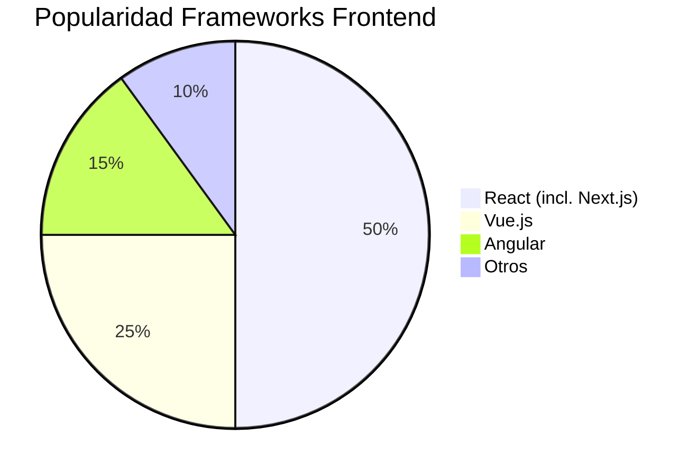
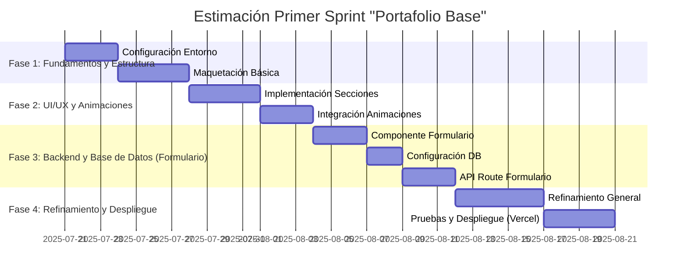
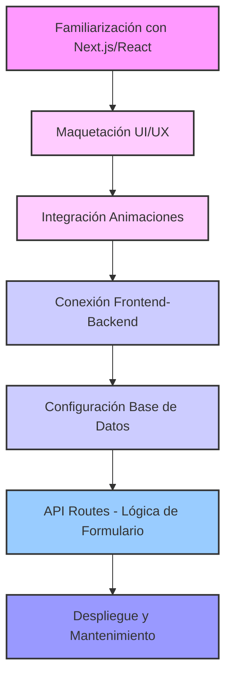

# 👋 ¡Hola! Soy Camilo — Bienvenido a mi Portafolio Técnico 🚀

Este es el repositorio de mi portafolio personal, una aplicación web dinámica construida como una **Single Page Application (SPA)** con tecnologías **Full-Stack JavaScript**. Este proyecto refleja mis habilidades tanto del lado del cliente como del servidor, integrando animaciones, APIs, bases de datos y despliegue moderno.

---

## ✨ ¿Qué estoy creando?

Una SPA moderna compuesta por secciones como:

- 🏠 Inicio
- 👨‍💻 Acerca de Mí
- 🧠 Proyectos
- ✉️ Contacto

Con transiciones suaves, diseño responsivo, interactividad y backend funcional.

---

## 🧹 Funcionalidades Destacadas

- ⚛️ **Diseño SPA con animaciones suaves** mediante **Next.js + React**
- 📬 **Formulario de contacto funcional** conectado a base de datos
- 🏷️ **Tablero de Tags interactivo** con validaciones y sugerencias inteligentes
- 📊 **Mapa de Palabras dinámico** para visualizar los tags más frecuentes
- ☁️ **Despliegue gratuito en Vercel**

---

## 🛠️ Tecnologías Clave (Stack Full-Stack JavaScript)

### Frontend

- **Tecnología:** `Next.js` con `React`
- **Librerías:** `Framer Motion`, `React Spring`

### Backend

- **Tecnología:** `Next.js API Routes` (Node.js)

### Base de Datos

- **Opciones:** `MongoDB Atlas` o `Google Firestore`
- **Formato:** NoSQL orientado a documentos (JSON/BSON)

### Despliegue

- **Plataforma:** `Vercel`

---

## 📈 Popularidad de Frameworks Frontend

---

## ⏱️ Estimación del Primer Sprint: "Portafolio Base"

---

## 📊 Curva de Aprendizaje y Flujo de Trabajo

---

## 🚀 Despliegue Gratuito con Vercel

- ✔️ Optimizado para Next.js
- 🔒 SSL gratuito por defecto
- 🔀 Despliegue continuo desde GitHub
- 💰 Plan gratuito ideal para proyectos personales

---

## 🎯 Objetivo del Proyecto

Más que una vitrina de proyectos, este portafolio demuestra mi habilidad para:

- Diseñar interfaces modernas y funcionales
- Integrar APIs y bases de datos en tiempo real
- Visualizar datos de forma atractiva (gráficas, tags)
- Mantener una arquitectura coherente con JavaScript full-stack

---

## 👀 ¡Gracias por visitar!

¿Tienes sugerencias o quieres colaborar? ¡Abramos una issue o un pull request!

---

### 🔗 Demo online próximamente en [mi dominio personal] o [Vercel]
